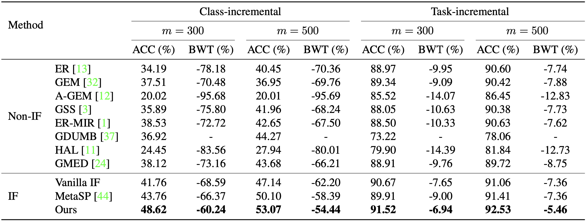

# Regularizing Second-Order Influences for Continual Learning

Code for CVPR 2023 submission "Regularizing Second-Order Influences for Continual Learning".

## Dependencies

```shell
pip install -r requirements.txt
```

Please specify the CUDA and CuDNN version for jax explicitly. If you are using CUDA 10.2 or order, you would also need to manually choose an older version of tf2jax and neural-tangents.

## Usage

Train and evaluate models through `utils/main.py`. For example, to train our model on Split CIFAR-10 with a 500 fixed-size buffer, one could execute:
```shell
python utils/main.py --model soif --load_best_args --dataset seq-cifar10 --buffer_size 500
```

To compare with the result of vanilla influence functions, simply run:
```shell
python utils/main.py --model soif --load_best_args --dataset seq-cifar10 --buffer_size 500 --nu 0
```

## Results

The following results on Split CIFAR-10 were obtained with single NVIDIA 2080 Ti GPU:



## Acknowledgement

Our implementation is based on [Mammoth](https://github.com/aimagelab/mammoth). We also refer to [bilevel_coresets](https://github.com/zalanborsos/bilevel_coresets) and [Example_Influence_CL](https://github.com/SSSunQing/Example_Influence_CL).
